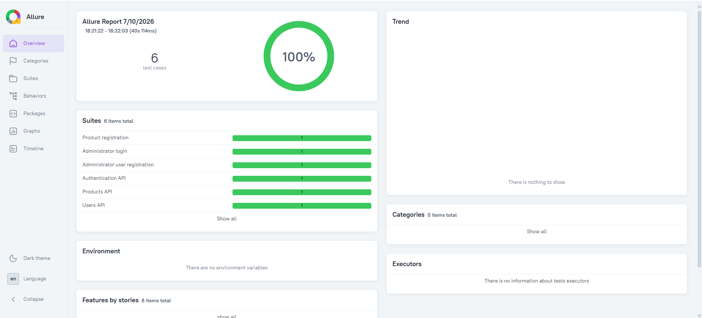

<div align="center">

# 🚀 ServeRest Cypress Automation Framework

Professional End-to-End and API Test Automation Framework built with **Cypress** and **JavaScript**.

Developed as part of a **QA Automation Technical Challenge**, following modern software engineering and test automation best practices.


</div>

---

# 📖 Overview

This project was developed as part of a QA Automation Technical Challenge.

The objective was to build a scalable, reusable and maintainable automation framework capable of validating both Frontend and API business flows.

The framework was designed following industry best practices with emphasis on:

- Maintainability
- Readability
- Reusability
- Scalability
- Dynamic Test Data
- Independent Test Execution
- Clean Architecture

---

# 🏗 Framework Architecture

```text
                     Test Cases
                          │
                          ▼
                    Page Objects
                          │
                          ▼
                  Custom Commands
                          │
         ┌────────────────┴────────────────┐
         ▼                                 ▼
   Frontend UI                      ServeRest API
                          │
                          ▼
                      Assertions
```

---

# 🛠 Technology Stack

| Technology | Purpose |
|------------|---------|
| Cypress 15 | End-to-End & API Automation |
| JavaScript (ES6) | Programming Language |
| Node.js | Runtime |
| Git | Version Control |
| GitHub | Source Code Management |
| Allure Report | Test Reporting |

---

# 📂 Project Structure

```text
.
├── cypress
│
├── e2e
│   ├── frontend
│   │   ├── user-registration.cy.js
│   │   ├── user-login.cy.js
│   │   └── product-registration.cy.js
│   │
│   └── api
│       ├── users.cy.js
│       ├── login.cy.js
│       └── products.cy.js
│
├── factories
│   ├── userFactory.js
│   └── productFactory.js
│
├── pages
│   ├── RegistrationPage.js
│   ├── LoginPage.js
│   ├── AdminHomePage.js
│   └── ProductRegistrationPage.js
│
├── support
│   ├── api
│   │   ├── auth.js
│   │   ├── users.js
│   │   └── products.js
│   │
│   ├── commands.js
│   └── e2e.js
│
├── fixtures
│
├── docs
│   └── evidence
│
├── cypress.config.js
├── package.json
└── README.md
```

---

# ✅ Implemented Features

- ✔ Cypress Configuration
- ✔ End-to-End Automation
- ✔ API Automation
- ✔ Page Object Model (POM)
- ✔ Factory Pattern
- ✔ Dynamic Test Data
- ✔ API Custom Commands
- ✔ Request Validation
- ✔ Response Validation
- ✔ Reusable Components
- ✔ Independent Test Execution
- ✔ Allure Report Integration

---

# 🎯 Automated Scenarios

## Frontend

| Scenario | Status |
|----------|--------|
| Administrator Registration | ✅ Completed |
| Administrator Login | ✅ Completed |
| Product Registration | ✅ Completed |

---

## API

| Scenario | Status |
|----------|--------|
| User Creation | ✅ Completed |
| Authentication | ✅ Completed |
| Authenticated Product Registration | ✅ Completed |

---

# 🔌 API Support Layer

The framework provides a reusable API layer used to prepare test data and support End-to-End scenarios.

| Component | Description | Status |
|-----------|-------------|--------|
| User Command | Creates administrator users dynamically | ✅ |
| Authentication Command | Retrieves Bearer Token | ✅ |
| Product Requests | Authenticated product creation | ✅ |
| Dynamic Factories | Generates unique users and products | ✅ |
| Request Validation | Validates payloads and headers | ✅ |
| Response Validation | Validates status codes and response body | ✅ |

---

# 🧪 Test Strategy

Each automated scenario is fully independent.

Whenever possible, test data is created dynamically through the API before executing UI interactions.

```text
Create Test Data

↓

Authenticate

↓

Execute Business Flow

↓

Validate UI

↓

Validate API

↓

Cleanup (when applicable)
```

This approach provides:

- Stable execution
- Better maintainability
- Faster execution
- No dependency between tests

---

# 📊 Test Execution Evidence

## Allure Report

Latest execution summary:

- ✅ Total Tests: **6**
- ✅ Passed: **6**
- ❌ Failed: **0**
- 📈 Success Rate: **100%**



---

# ▶ Running the Project

Install dependencies

```bash
npm install
```

Open Cypress

```bash
npm run cy:open
```

Run all tests

```bash
npm run test:all
```

Run Frontend tests

```bash
npm run test:frontend
```

Run API tests

```bash
npm run test:api
```

Generate Allure Report

```bash
npm run report
```

Open Allure Report

```bash
npm run allure:open
```

---

# ✔ Best Practices Applied

- Page Object Model
- Factory Pattern
- Dynamic Test Data
- API Data Preparation
- Independent Test Execution
- Clean Code
- Separation of Responsibilities
- Reusable Commands
- Explicit Assertions
- Git Version Control
- Professional Documentation

---

# 📈 Development Timeline

## Version 1.0

- Initial project setup
- Cypress configuration
- Project structure

## Version 1.1

- Administrator Registration
- User Factory

## Version 1.2

- Login automation
- Authentication API

## Version 1.3

- Product Registration
- Product Factory

## Version 1.4

- API Test Suite
- User API
- Login API
- Product API

## Version 1.5

- Allure Report Integration
- Professional Documentation
- Final Framework Review

---

# 🚀 Future Improvements

- GitHub Actions Pipeline
- Docker Support
- Environment Management
- Parallel Execution
- Test Data Cleanup Service
- Publish Allure Report via GitHub Pages

---

# 👨‍💻 Author

**Caio Silva**

Senior QA Engineer

GitHub

https://github.com/caiovfsilva-cmyk

LinkedIn

https://www.linkedin.com/in/caiovfsilva

---

# 📄 License

This project was developed for educational purposes, portfolio presentation and technical assessment in Software Quality Assurance.

It demonstrates modern QA Automation practices using Cypress, JavaScript and API Testing.